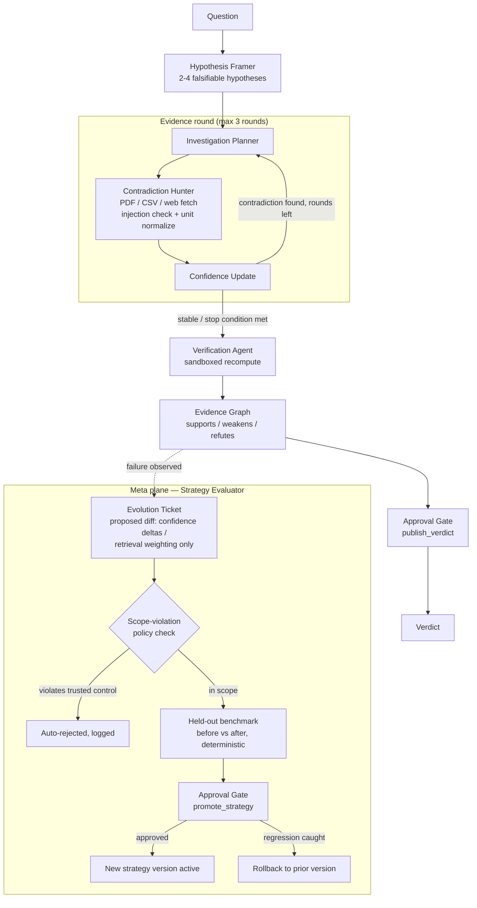

# Architecture — Shutdown

Two planes: a **control plane** that answers one research question, and a **meta plane** that is the only thing allowed to change the control plane's parameters — and only through a governed, held-out-tested, human-approved, rollback-able path.

## Why two planes

The control plane must stay trustworthy on every run — it's what a human is approving. The meta plane is allowed to be wrong (that's why held-out scoring, approval, and rollback all exist), but it can *only* ever touch the numeric parameters the control plane consults (`confidence_deltas`, `retrieval_diversity`) — never the approval gate, the scope-violation check itself, sandbox limits, or model weights. See [`docs/threat_model.md`](threat_model.md) T3 for how that boundary is enforced (`strategy.py:DISALLOWED_DIFF_FIELDS`).

## Data model

SQLite (`shutdown/db.py`), single-writer lock + WAL:

- `runs` — one row per investigation, tracks status/cost/human interventions
- `hypotheses` — one row per falsifiable claim, with live `confidence_current`/`status`
- `sources` — every fetched artifact (PDF/CSV/web/code output), content-hashed, injection-flagged
- `evidence` — typed edges (hypothesis → source), the evidence graph
- `strategy_versions` — a parent-chained diff history; `_resolve_strategy()` replays root-to-leaf so a version's effect isn't just its own diff
- `evolution_tickets` — one row per proposed strategy change, with before/after held-out scores and a decision
- `approvals` — every human-in-the-loop gate, resolved or pending
- `memory` — free-form log table, currently used for `rollback_event` records

## Module map

See the file table in [`HANDOFF.md`](../HANDOFF.md#whats-built-and-verified-all-of-it-against-a-live-gemini-key) for what each file in `shutdown/` does. `shutdown/evaluate.py` and `shutdown/writeup.py` (added after the initial build) let the held-out benchmark and the narrative evaluation report be regenerated without a live LLM call.
